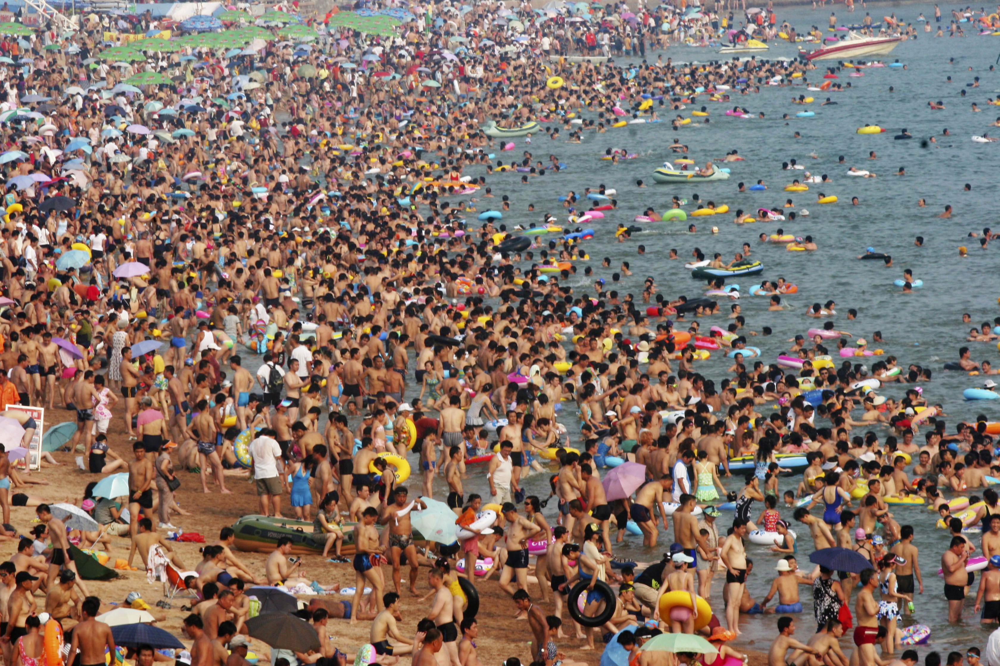

# Crowd Counting-Pytorch
 
Based on [CrowdNet](https://arxiv.org/abs/1608.06197) by Boominathan et al.

Pytorch implementation of CrowdNet. A fast way to count dense crowd.

## Setup

### Prerequisites
* Pytorch

### Recommended
* Linux with Pytorch + CUDA + cuDNN

### Getting Started

```
# clone this repo
git clone https://github.com/BingzheWu/pytorch_crowd_count

cd pytorch_crowd_count-master

# download the dataset [UCF_CC_50](http://crcv.ucf.edu/data/crowd_counting.php)

# data preprocessing
python data_processed.py

# train the model(the time depends on your hardware)
python train.py

# test the model
python demo.py

```
## Dataset
The dataset used is the UCF_CC_50, it contains 50 pairs of pictures.

For example:




## To be continued...


