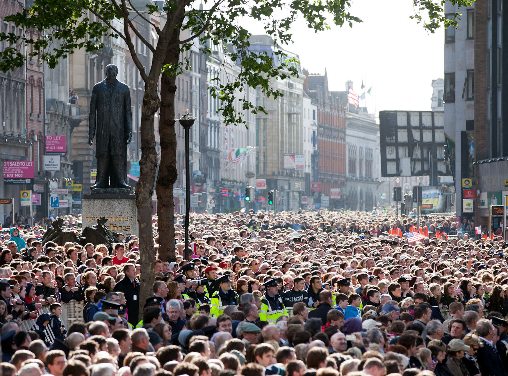
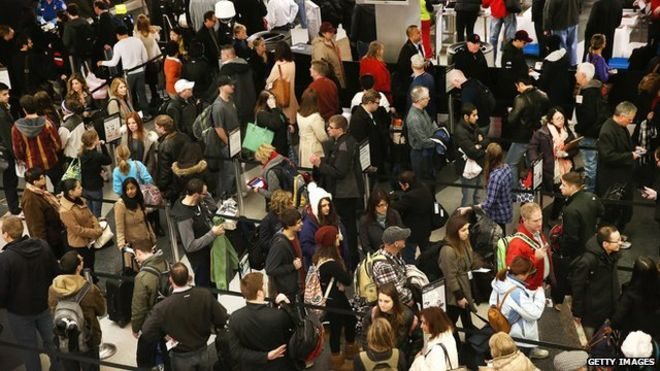
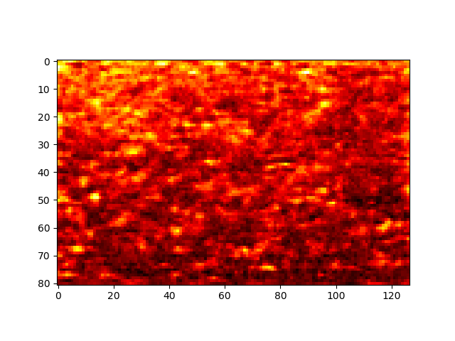
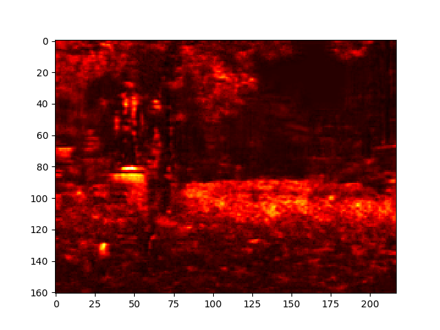
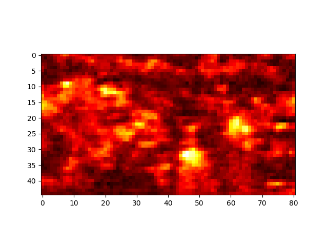

# Crowd Counting-Pytorch
 
Based on [CrowdNet](https://arxiv.org/abs/1608.06197) by Boominathan et al.

Pytorch implementation of CrowdNet. A fast way to count dense crowd.

## Setup

### Prerequisites
* Pytorch

### Recommended
* Linux with Pytorch + CUDA + cuDNN

### Getting Started

```
# clone this repo
git clone https://github.com/BingzheWu/pytorch_crowd_count

cd pytorch_crowd_count-master

# download the dataset [UCF_CC_50](http://crcv.ucf.edu/data/crowd_counting.php)

# data preprocessing
python data_process.py

# train the model(the time depends on your hardware)
python train.py

# test the model
python demo.py

```
## Dataset
The dataset used is the UCF_CC_50, it contains 50 pairs of pictures.

For example:





## Output
After train, we got the output heatmaps of those three as follows:





## Pretrain
In the paper, the test data is the UCF_CC_50, but the author didn't mention the train data. In our job, we used the famous imagenet to pretrain the deep net and used ShanghaiTech image dataset to train the whole net.

The pretraining is so easy, because pytorch had offered us the code.
```
vgg16 = torchvision.models.vgg16_bn(pretrained =  True)
```

After the pretraining, what we should do is just finetuning.

## Data_process
Before training the model, we should create the train_data
* read the image and the ground truth from dataset
* generate density image by gaussian filter
* multiscale_pyramidal, which increases the amount of data(detail in paper)
* generate_slices, cut the whole pictures into slices to train
* lmbd create, made it faster to read the data

## Models
The net is composed by two parts, one is deep net, the other is shallow net.
the deep one is created according to the famous vgg16, as the paper goes, we removed the fully connected layer and the last maxpool layer and set the fourth maxpool layer's stride to 1 so that the output can be 1/8 of the input image. And the important hole convolution cannot be omitted, for it increases the receptive field.

## Train
As the paper goes, we set the learning rate as 1e-7, and momentum 0.9
The train time is about eight hours on my gtx1060(6G)
We saved the net in the ./checkpoint

## Demo
We use the UCF_CC_50 dataset to test the net.

## Metrix
In the end, we test the metrix of the crowdnet.
We get the MAE and MSE.